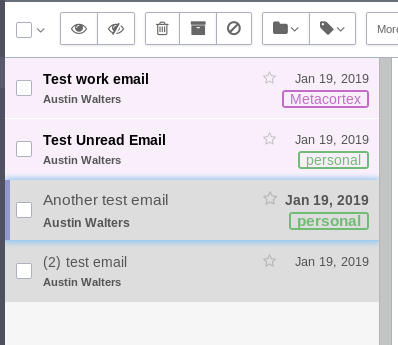
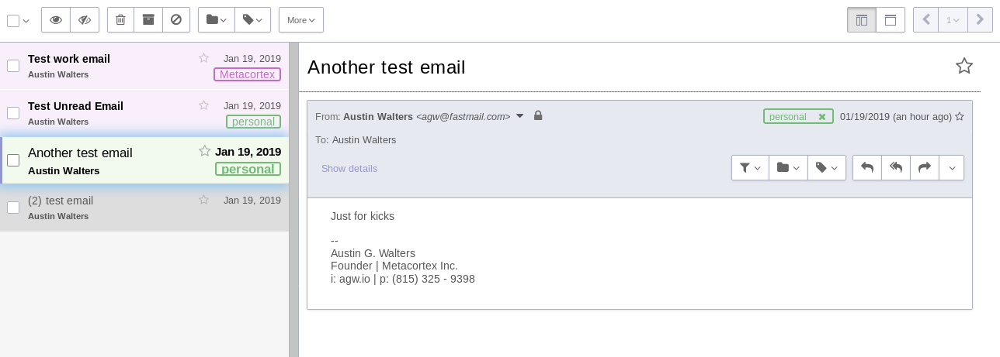

Austin's ProtonMail Theme
=========================

I recently switched to ProtonMail, one nice aspect of ProtonMail is that you can set your own theme.

Within the `css/` folder you will find my theme. Images below as well.

### Updated Tray

*Original Tray:*

*Updated Conversations Column:*

### Updated Marking 

### Updated multi-selecting

### Updated Active Conversation

